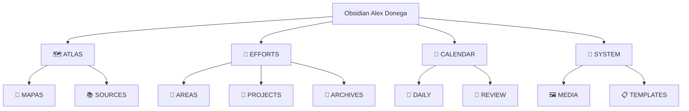

#  🧠Obsidian Alex Donega


`BUTTON[home]` 

```meta-bind-button
label: HOMEPAGE
icon: home
hidden: true
class: ""
id: home
style: primary
actions:
  - type: open
    link: "[[HOMEPAGE]]"
```
# 📁 Estrutura de Pastas e Subpastas




```markdown
├── 🗺️ ATLAS
│   ├── 🧭 MAPAS
│   ├── 📚 SOURCES
│   │   ├── 📁 ARTIGO
│   │   ├── 📁 VIDEOS
│   │   ├── 📁 LIVROS
│   │   ├── 📁 AULAS
│   │   ├── 📁 MUSICAS
│   │   └── 📁 PESSOAS
├── 🚀 EFFORTS
│   ├── 📁 AREAS
│   ├── 📂 PROJECTS
│   ├── 📁 ARCHIVES
├── 📅 CALENDAR
│   ├── 📁 DAILY
│   └── 📁 REVIEW
├── 📁 SYSTEM
│   ├── 🖼️ MEDIA
│   │   ├── 📁 DESIGN
│   │   └── 📁 Visuals
│   │       ├── 📁 Images
│   │       └── 📁 Excalidraw
│   └── 📋 TEMPLATES
│       ├── 📁 FORMAT
│       └── 📁 SNIPPET


```
---


- `+` : Coleção de recursos e ferramentas em desenvolvimento.
- `ATLAS` : Compilação de mapas mentais e conceituais.
	- `MAPAS` : Coleção de mapas geográficos e conceituais.
	- `SOURCES` : Fontes de pesquisa e referência.
		- `AULAS` : Notas e materiais de aulas assistidas.
		- `ARTIGO` : Artigos em desenvolvimento ou concluídos.
		- `MUSICAS` : Coleção de músicas e playlists.
		- `LIVROS` : Resumos e anotações de livros lidos.
		- `PESSOAS` : Informações sobre contatos importantes.
		- `VIDEOS` : Arquivo de vídeos educacionais e inspiradores.
- `CALENDAR` : Calendário de eventos e lembretes importantes.
	- `DAILY` : Notas diárias sobre reflexões e aprendizados.
	- `REVIEW` : Revisões periódicas de conteúdo e metas.
- `EFFORTS` : Registro de metas e esforços dedicados.
	- `ARCHIVES` : Documentos e notas arquivadas.
	- `AREAS` : Áreas de foco e interesse pessoal.
	- `PROJECTS` : Projetos em andamento e concluídos.
- `SYSTEM` : Arquivos de configuração e sistema do Vault.
	- `TEMPLATES` : Modelos para criação rápida de documentos.
		- `FORMAT` : Templates e formatos padrões para notas.
		- `SNIPPET` : Trechos de código e atalhos úteis.
	- `MEDIA` : Arquivos de mídia, como vídeos e músicas.

---

### 🔗 CONNECTIONS: Como as notas se relacionam

- Links Diretos: Sempre que mencionar ou referenciar outra nota, crie um link direto usando `[[Nome da Nota]]`.
- Backlinks: Revise regularmente os backlinks para identificar novas conexões potenciais.
- Mapas Mentais: Use o plugin de grafos para visualizar e analisar as conexões entre suas notas.

Campos Padrão (Frontmatter):

Para manter a consistência, cada nota deve começar com um frontmatter contendo:

```yaml
---
created: 2023-01-01
up: 2023-01-02
collection: NomeDaColeção
related: [NomeDaNota1, NomeDaNota2]
---
```

- `created`: Data de criação da nota.
- `up`: Última data de atualização.
- `collection`: A que coleção a nota pertence.
- `related`: Notas relacionadas para revisão futura.

### 🛠 Boas Práticas para Manutenção

- Revisão Regular: Reserve um tempo semanalmente para revisar e atualizar notas, garantindo que as informações permaneçam relevantes e corretas.
- Limpeza de Tags e Pastas: Periodicamente, revise tags e a estrutura de pastas para evitar redundâncias ou categorias desatualizadas.
- Backup: Faça backups regulares de sua vault para evitar perda de dados.
- Plugins: Utilize plugins que complementam seu fluxo de trabalho, mas mantenha a simplicidade para não sobrecarregar o sistema.

Implementando estas diretrizes, você criará uma vault do Obsidian altamente organizada e eficiente, facilitando não apenas o armazenamento de informações, mas também a recuperação e conexão de conhecimento de forma intuitiva.

---

# 🔌 Plugins

| Plugin                                                                                         | Descrição Breve                                                           |
| ---------------------------------------------------------------------------------------------- | ------------------------------------------------------------------------- |
| [Advanced URI](https://github.com/Vinzent03/obsidian-advanced-uri)                             | Controle do vault via URLs                                                |
| [BRAT](https://github.com/TfTHacker/obsidian42-brat)                                           | Plugins beta com atualizações automáticas                                 |
| [Calendar](https://github.com/liamcain/obsidian-calendar-plugin)                               | Calendário para notas diárias                                             |
| [Callout Manager](https://github.com/eth-p/obsidian-callout-manager)                           | Criação de callouts sem CSS                                               |
| [Charts View](https://github.com/caronchen/obsidian-chartsview-plugin)                         | Geração de gráficos interativos                                           |
| [Commander](https://github.com/phibr0/obsidian-commander)                                      | Comandos personalizados                                                   |
| [Custom Frames](https://github.com/gino-ple-bags/obsidian-custom-frames)                       | Embeds de páginas web                                                     |
| Dashboard Navigator                                                                            | Substituído por [Homepage](https://github.com/mirnovov/obsidian-homepage) |
| [Datacore](https://github.com/blacksmithgu/obsidian-datacore)                                  | Engine de dados moderna                                                   |
| [Dataview](https://github.com/blacksmithgu/obsidian-dataview)                                  | Consulta de notas como banco de dados                                     |
| [Editing Toolbar](https://github.com/cumany/obsidian-editing-toolbar)                          | Barra de edição flutuante                                                 |
| [Excalidraw](https://github.com/zsviczian/obsidian-excalidraw-plugin)                          | Ferramenta de desenho e quadros                                           |
| [Force note view mode](https://github.com/bwca/obsidian-force-view-mode-of-note)               | Define modo fixo de abertura das notas                                    |
| [Home tab](https://github.com/oliverschwendener/obsidian-home-tab)                             | Aba inicial como em navegador                                             |
| [Homepage](https://github.com/mirnovov/obsidian-homepage)                                      | Define a nota inicial ao abrir o Obsidian                                 |
| [Hotkeys for specific files](https://github.com/Vinzent03/obsidian-hotkeys-for-specific-files) | Atalhos para abrir arquivos específicos                                   |
| [Iconic](https://github.com/aidenlx/obsidian-iconic)                                           | Ícones personalizados para arquivos                                       |
| [JS Engine](https://github.com/Fevol/obsidian-js-engine)                                       | Permite execução JS para plugins                                          |
| [List Callouts](https://github.com/mgmeyers/obsidian-list-callouts)                            | Callouts a partir de listas simples                                       |
| [Meta Bind](https://github.com/mnaouass/obsidian-meta-bind-plugin)                             | Inputs conectados ao frontmatter                                          |
| [Outliner](https://github.com/vslinko/obsidian-outliner)                                       | Estilo outliner com atalhos de organização                                |
| [Paste URL into selection](https://github.com/denolehov/obsidian-url-into-selection)           | Transforma texto em link ao colar URL                                     |
| [Periodic Notes](https://github.com/liamcain/obsidian-periodic-notes)                          | Notas periódicas (semana/mês/ano)                                         |
| [Projects](https://github.com/marcusolsson/obsidian-projects)                                  | Tabela, kanban e calendário para projetos                                 |
| [QuickAdd](https://github.com/chhoumann/quickadd)                                              | Captura rápida de conteúdos                                               |
| [Recent Files](https://github.com/tgrosinger/recent-files-obsidian)                            | Lista de arquivos abertos recentemente                                    |
| [Status Bar Organizer](https://github.com/L7Cy/obsidian-customizable-statusbar)                | Customização da barra de status                                           |
| [Style Settings](https://github.com/mgmeyers/obsidian-style-settings)                          | Interface gráfica para temas e plugins                                    |
| [Tabs](https://github.com/git-yustasse/obsidian-tabs)                                          | Abas de navegação entre arquivos                                          |
| [Tasks](https://github.com/obsidian-tasks-group/obsidian-tasks)                                | Tarefas com datas, prioridades e filtros                                  |
| [Templater](https://github.com/SilentVoid13/Templater)                                         | Engine de templates com lógica JS                                         |

---

# 📚 Inspirações e Recursos

- [Linking Your Thinking - Nick Milo](https://www.linkingyourthinking.com/)
- [Dusk Vault](https://github.com/DuskWasHere/dusk-obsidian-vault)
- [PARA - Fortelabs](https://fortelabs.com/blog/para/)
- [Snippets Customizados](https://github.com/NonakaVal/Obsidian-CSS-Snippets)
- [Dashboard ++](https://github.com/TfTHacker/DashboardPlusPlus)
- [Multi-Column Markdown](https://github.com/ckRobinson/multi-column-markdown)
- [Modular CSS Layout](https://github.com/efemkay/obsidian-modular-css-layout)
